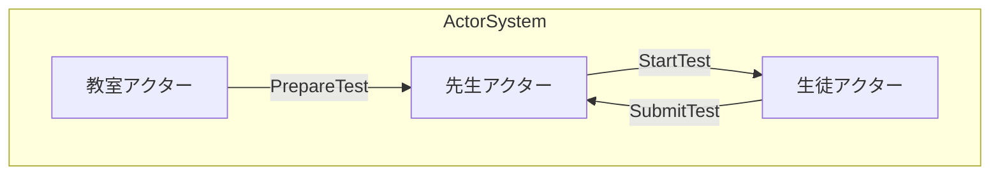
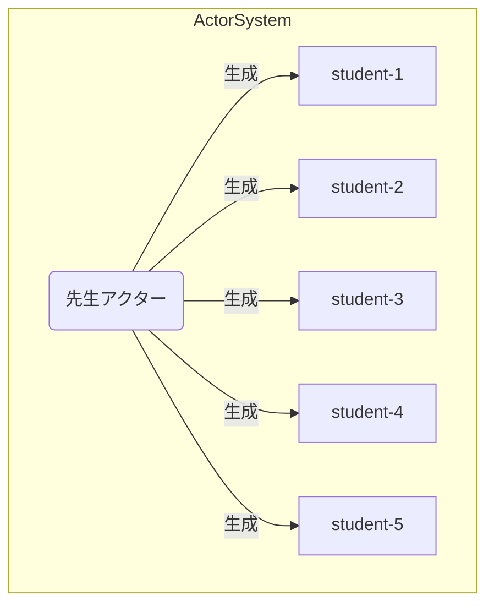

# phluxor-example

php actor model toolkit [phluxor](https://github.com/ytake/phluxor) example.  

classroom / teacher / student actors example.

最後にPoisonPillでアクターが終了します。  
finally, actor is terminated by PoisonPill.

