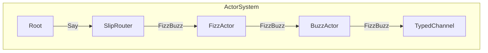

# Fizz Buzz actor model example

This is a sample project to demonstrate the use of Phluxor.  

```mermaid
flowchart TD
subgraph ActorSystem
    Root --> |Say| SlipRouter
    SlipRouter --> |FizzBuzz| FizzActor
    FizzActor --> |FizzBuzz| BuzzActor
    BuzzActor --> |FizzBuzz| TypedChannel
end
```
